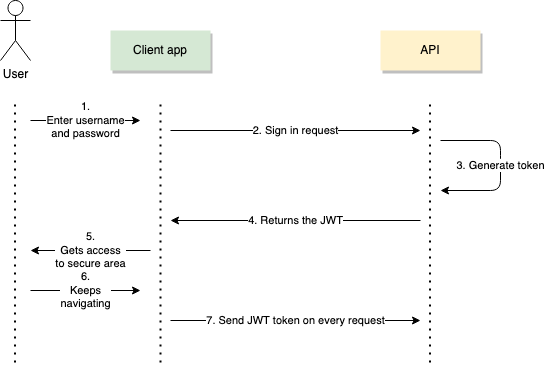
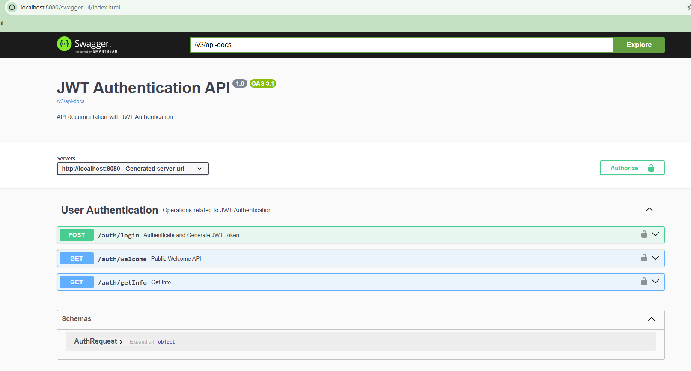

# JWT Authentication Demo

This project demonstrates JWT-based authentication using Spring Boot. It includes endpoints for user authentication, token generation, and JWT validation. The application also showcases the use of Swagger for API documentation, global exception handling, and logging.

## Project Flow

1. **User Authentication**
    - A user sends a POST request to `/auth/generateToken` with the username and password.
    - The system authenticates the user by validating credentials via `AuthenticationManager`.
    - If authentication is successful, a JWT token is generated and returned.
    - If authentication fails, an error message is returned.

2. **Accessing Secure Endpoints**
    - Secure endpoints (e.g., `/auth/testJwtToken`) can be accessed only if a valid JWT token is provided in the request header.
    - The JWT token is validated, and access is granted if the token is valid.

3. **Swagger Integration**
    - The project uses Swagger for API documentation. Access the Swagger UI to explore and test the API endpoints.

---

## Endpoints

### 1. Public Welcome API

**Endpoint:** `/auth/welcome`

**Method:** `GET`

**Description:** This endpoint provides a welcome message. No authentication is required.

**Response:**
"Welcome this endpoint is not secure"

### 2. Authenticate and Generate JWT Token

**Endpoint:** `/auth/login`

**Method:** `POST`

**Description:** This endpoint validates user credentials (username and password) and returns a JWT token if authentication is successful.

** Request Body:
{
"username": "user",
"password": "password"
}

**Response:
"JWT Token"

### 3. JWT-Protected Test Endpoint

**Endpoint:** ` /auth/getInfo`

**Method:** `GET`

**Description:** This endpoint is protected and requires a valid JWT token. It returns a success message if the JWT is valid.

**Response (Success): "Valid JWT Token"

**Response (Failure - Invalid Token): "Unauthorized - Invalid or missing JWT token"

## Swagger API Documentation

Swagger provides an interactive interface for API documentation and testing. To access the Swagger UI, launch the application and visit:

http://localhost:8080/swagger-ui/

Swagger allows you to test the API endpoints directly from the browser.

## Global Exception Handling
The project implements global exception handling using a @ControllerAdvice class. Any authentication errors or validation exceptions are captured by the global exception handler and returned as user-friendly response

## Logging
The project uses SLF4J for logging with Logback as the logging framework. Logs are recorded at various points in the application to track the flow of requests and errors.

## Dependencies
### 1. Spring Boot 3.x
### 2. Spring Security
### 3. Swagger (OpenAPI 2.8.4)
### 4. SLF4J Logging
### 5. JWT (JSON Web Token)

## How to Run the Project
### 1. Clone the repository:

git clone https://github.com/nishakumari06021990/jwt-auth-demo.git

cd jwt-auth-demo

### 2. Build the project:

./mvnw clean install

### 3. Run the application:
./mvnw spring-boot:run

The application will be available at http://localhost:8080.

